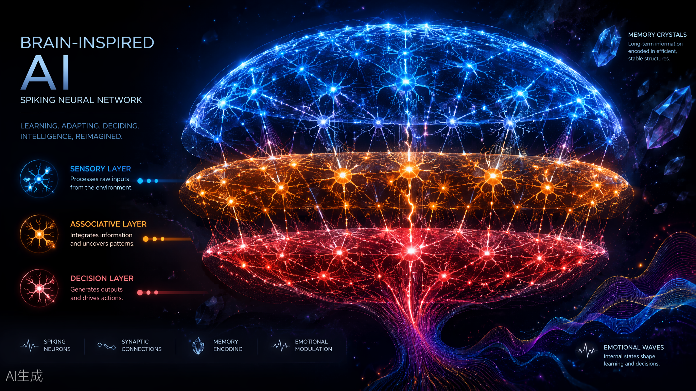

# AI 大脑实体（AIBrainEntity）



一个**纯原生 Python** 实现的类脑智能体架构：不依赖任何第三方库即可运行，
模拟生物大脑的感知、学习、记忆、情绪与决策全过程。v3.0 起支持
STDP 脉冲时序可塑性、多巴胺样奖励强化学习、真实多模态（CLIP/Whisper）
接入与多实体群体智能。v4.x 持续演化出完整认知闭环：
v4.0 可学习投影 / RPE 误差 / 文化动力学 / 动作空间与语言生成；
v4.1 执行器闭环与社交拓扑相变；v4.2 共同演化网络；
v4.3 多模因竞争（垄断 vs 极化）；v4.4 TD(λ) 资格迹；
v4.5 执行器技能学习；v4.6 检索式语言生成；
v4.7 情景记忆时间索引；v4.8 睡眠-清醒节律（SHY）；
v4.9 好奇驱动探索——感知、学习、记忆、行动、社会、节律的全栈类脑仿真。
v5.0 思考体系：思考空间（全局工作区）、思考记忆（think 固化）、
思考感官（introspect 内感觉与元认知日志）。
v5.1 动作与决策扩展：意图动词 3→8（ask/retrieve/plan/execute/wait）、
深思熟虑决策（带 rationale 理由链）、函数/文件执行器。

## 它是什么

`AIBrainEntity` 是一个"独立大脑实体"。它不是一个聊天机器人外壳，而是一个
具有内部状态的仿真体——你给它刺激，它的神经元会放电、突触会学习、记忆会
固化或遗忘、情绪会波动，然后由决策中枢产生行为输出。

```
外部刺激 → 感官层(16神经元) → 联想层(32神经元) → 决策层(8神经元) → 行为输出
                ↓                    ↓                    ↓
           感官缓存(8)    →    短期记忆(20)    →    长期记忆(500)
                └──── 情绪内核 ←→ 注意力调制 ←→ 多巴胺奖励 ────┘
```

## 核心机制

| 模块 | 生物对应 | 实现 |
|---|---|---|
| 脉冲神经元 | LIF 神经元 | 膜电位累积-泄漏-阈值放电-复位-不应期 |
| 突触可塑性 | **STDP** | 前→后放电 LTP / 后→前放电 LTD，指数时间窗 τ=3 网络步，覆盖前馈与循环通路 |
| 奖励强化学习 | 多巴胺系统 | `reward()` 调制学习速率 ×(1+多巴胺)，奖励促愉悦、惩罚促压力 |
| 三级记忆 | 感觉登记→短时→长时 | 感官缓存 → STM(容量竞争) → LTM(固化) |
| 遗忘 | 艾宾浩斯曲线 | 记忆权重指数衰减，低于阈值删除 |
| 回忆再巩固 | Reconsolidation | 每次成功回忆都会强化该记忆 |
| 情绪内核 | 边缘系统 | 平静/好奇/压力/愉悦四维动态变量 |
| 注意力 | 注意调制 | 好奇心↑注意、压力↓注意，反作用于感官输入 |
| DNA 遗传 | 记忆传承 | 全状态序列化（突触+记忆+情绪），支持克隆 |
| **群体智能** | 文化传递 | `BrainSwarm`：记忆跨实体传递、广播、带变异繁衍 |
| **脉冲思考链** | 可解释性 | `thought_chain()`：把感知→传导→回响→决策展开为可读的脉冲因果链 |
| 多模态接口 | 感官通道 | **可插拔自定义模型**：注册自定义编码器 / 更换 CLIP、Whisper 模型名（未装依赖自动降级伪 embedding） |
| **可学习投影** | 感觉皮层映射 | `LearnableProjection`：随机投影 + Oja 在线 PCA，保符号中心化归一化，保留稠密 embedding 对比度 |
| **RPE/TD 学习** | 多巴胺预测误差 | `reward_td()`：δ = r − V 驱动多巴胺，奖励被预测后反应自然衰减 |
| **动作空间** | 运动输出 | `decide_action()`：决策层脉冲 → 结构化动作指令（verb/强度/情绪） |
| **语言生成** | 布洛卡区 | `express()`：按 (动作 × 情绪) 模板生成自然语言，引用联想记忆 |
| **动作执行器** | 效应器 | `act()`：决策→机器人/HTTP API 执行→`reward_td` 奖励回传闭环 |
| **文化动力学** | 水平/垂直传播 | `horizontal_transfer` / `vertical_transfer` + `consensus()` 共识涌现度量 |
| **社交拓扑** | 社会网络 | `set_topology()`：全连接/环/星/随机/小世界，`consensus_convergence()` 测相变收敛速度 |
| **拓扑自适应** | 共同演化网络 | `rewire_coevolve()`：异见边"模仿 vs 断边重连"博弈 + 求知连边，共识压力驱动边生灭 |
| **多模因竞争** | 文化生态 | `competition_dynamics()`：立场转化 vs 阵营隔离，φ 决定垄断共识或极化共存 |
| **资格迹** | 多巴胺时序迁移 | `reward_lambda()`：TD(λ) 按迹强度把 RPE 反向分配给近期状态，信用分配跨 tick 传播 |
| **技能学习** | 纹状体动作选择 | `learn_skill()` + `select_verb()`：分 verb 独立价值 Q，greedy/ε-greedy/softmax 策略化选择 |
| **检索式语言** | 布洛卡区+海马 | `compose()`：LTM 片段检索（n-gram 降级）→ 记忆编织（单句/并列/联想链）→ 句法框架造句 |
| **情景记忆** | 海马时间细胞 | `episodes` + `events_after()`/`events_before()`：何时发生、与何事共现，"上次……之后"式时间推理 |
| **睡眠节律** | 记忆重放+SHY | `sleep()`：离线重放固化弱记忆，突触等比缩放剪除弱连接（保留相对差异），压力恢复 |
| **好奇驱动** | 新皮层-边缘系统 | `_assess_novelty()`：未命中率+|RPE| 双通路评估新奇度，当 tick 注意捕获；`effective_epsilon()` 新奇→多探索/熟悉→多利用；含习惯化（反复暴露新奇度衰减）与寻求刺激人格差异（SSS） |
| **思考体系** | 全局工作区+内感觉 | `thought_space`：念头激活度衰减/容量 7±2；`think()` 念头回注网络、高激活固化进 STM；`introspect()` 感知自身脑活动并记元认知日志 |
| **意图动词** | 基底节动作选择扩展 | v5.1：`INTENT_VERBS` 8 verb（ask/retrieve/plan/execute/wait）独立 Q 值，`decide_action(deliberate=True)` 带 rationale 理由链；`make_function_executor`/`make_file_executor` 实用执行器 |

## 依赖说明

核心模块零第三方依赖，仅需 Python 3.8+ 标准库；实验绘图需要
matplotlib/seaborn/pandas；多模态真实编码需要 transformers/torch
（不装自动降级为伪 embedding，不影响核心功能）。

## 快速开始

```bash
pip install -r requirements.txt   # 仅实验复现脚本需要（核心模块零依赖）

python ai_brain_entity.py    # 运行内置演示（含 STDP/奖励/多模态/群体/v4.0/v4.1 演示）
python swarm.py              # 群体文化传递演示（定向传递+变异+世代链+相变扫描+多模因竞争）
python experiments.py        # 复现实验 1-8（统一入口，生成 figures/ 与 data/ 结果）
python encoder_status.py        # 观测台编码器面板数据（另两个导出器：brain_activity_trace / thought_chain_scenarios）
python run_all.py               # 一键全流程：测试 → 演示 → 实验 → 观测数据（--quick 快速模式）
python -m unittest discover tests  # 运行核心行为测试（129 项）
```

```python
from ai_brain_entity import AIBrainEntity, BrainSwarm

brain = AIBrainEntity("Brain-01", seed=42)
print(brain.sensory_input("记忆是智慧的基石"))

# 多巴胺奖励：学习前给奖励，STDP 学习速率最高翻倍
brain.reward(0.8)
brain.sensory_input("奖励关联的刺激")

# 真实多模态：CLIP 图像 / Whisper 音频 embedding（未装依赖自动降级）
brain.perceive_image("cat.jpg", label="一张猫的图片")
brain.perceive_audio("sound.wav", label="一段语音")
brain.sensory_input_vector([0.2, -0.5, 0.9, ...], label="任意 embedding")

# 自定义多模态模型（v3.1）：三种接入方式
# 1) 注册任意自定义编码器：callable(path) -> 数值序列，长度任意
def my_image_model(path):
    return my_framework.encode(path)          # 你自己的模型
register_image_encoder(my_image_model, name="mine")   # 设为全局默认
brain.perceive_image("cat.jpg")                        # 自动走自定义模型
brain.perceive_image("cat.jpg", encoder=my_image_model)  # 或一次性指定
unregister_image_encoder("mine")                       # 注销后回落内置链
# 2) 更换内置模型名（自定义微调版 CLIP / Whisper，HF 名称或本地路径）
set_clip_model("path/to/my-finetuned-clip")
set_whisper_model("large-v3")
# 3) 查看当前编码器状态
print(list_encoders())

# ===== v4.0 四大扩展 =====

# 可学习投影：替代线性插值，保留稠密 embedding 对比度
brain.enable_projection(True)
brain.sensory_input_vector(dense_vec, label="512 维 embedding")  # 投影 + Oja 在线训练

# RPE/TD 误差：多巴胺响应"意外"而非奖励本身
brain.reward_td(0.8)        # 首次：RPE=+0.800（意外）
# ... 重复 30 次后：RPE≈0（奖励被预测，多巴胺不再波动）
# 突然给 -0.5：RPE=-1.3（意外重现）

# 动作空间 + 语言生成
act = brain.decide_action("火焰是危险的")   # {"action","verb","intensity","mood","recalled"}
ex = brain.express("火焰是危险的")          # {"action":..., "utterance": "（「火焰是危险的」——静默观察中。）"}

# 文化动力学：水平（同代）vs 垂直（跨代）+ 共识涌现
swarm2 = BrainSwarm(["E1", "E2", "E3"], seed=1)
swarm2.reproduce(0, "F1")                                # 子代 generation=2
swarm2.horizontal_transfer(rounds=6)                     # 同伴扩散
swarm2.vertical_transfer(rounds=6)                       # 师承传递
dyn = swarm2.transmission_dynamics("钻木可以取火", rounds=4, direction="horizontal")
con = swarm2.consensus(stimulus="钻木可以取火")          # 记忆共识 + 行动共识指数

# ===== v4.1 扩展 =====

# 动作执行器闭环：决策 → 执行 → 执行结果回传为奖励
from ai_brain_entity import make_robot_executor, make_api_executor
brain.register_executor(make_robot_executor(strictness=0.3), default=True)
brain.register_executor(make_api_executor("https://example.com/act"), verb="respond")
out = brain.act("火焰是危险的")
# out = {"utterance", "action", "execution": {success, reward, detail},
#        "feedback": reward_td 回传结果} —— 执行成败的"意外"驱动多巴胺

# 社交拓扑 + 共识相变：文化只沿社交边传播
swarm2.set_topology("small_world", p=0.3)   # 全连接/环/星/随机/小世界
conv = swarm2.consensus_convergence("钻木可以取火", threshold=0.9)
# 实测（N=8）：小世界 18 轮 < 全连接 26 轮 < 环形 45 轮；
# N=12 时稀疏拓扑无法收敛（相变），详见 swarm.py consensus_phase_scan

# ===== v4.2 拓扑自适应（共同演化网络） =====
swarm2.set_topology("ring")
res = swarm2.coevolve_consensus("钻木可以取火", threshold=0.9, rewire_prob=0.5)
# 异见边逐轮博弈：1-φ 观点模仿 / φ 断边重连到同道；未持有者求知连边
# 实测（N=12 环形）：静态 >60 轮不收敛 → 共同演化 4 轮收敛
# φ 三区：0.2→3 轮（传播主导）/ 0.5→4 轮（平衡）/ 0.8→7 轮（结构 churn）

# ===== v4.3 多模因竞争（文化生态） =====
import time as _time
from ai_brain_entity import BrainMemory
swarm3 = BrainSwarm([f"A{i}" for i in range(12)], seed=1)
swarm3.set_topology("ring")
for i, b in enumerate(swarm3.population):   # 前半持钻木、后半持燧石
    meme = "钻木可以取火" if i < 6 else "燧石可以取火"
    b.long_memory.append(BrainMemory(content=meme, timestamp=_time.time(),
                                     weight=1.0, tag="culture"))
mono = swarm3.competition_dynamics(["钻木可以取火", "燧石可以取火"], rewire_prob=0.2)
# φ 低 → 立场转化主导 → 垄断：实测「燧石可以取火」17 轮统一全网
polar = swarm3.competition_dynamics(["钻木可以取火", "燧石可以取火"], rewire_prob=0.85)
# φ 高 → 阵营隔离主导 → 极化共存：实测 0.67/0.33 两阵营各自封闭

# ===== v4.4 TD(λ) 资格迹：信用分配跨 tick 传播 =====
lam_brain = AIBrainEntity("λ", seed=1)
for _ in range(20):                     # Schultz 范式：三线索链 → 奖励
    for cue in ["铃声", "灯光", "气味"]:
        lam_brain.sensory_input(cue)
    r = lam_brain.reward_lambda(1.0)    # RPE 按资格迹反向分配给全部线索
# 实测：V(气味)=0.99 > V(灯光)=0.71 > V(铃声)=0.51（γλ 时间梯度），
# 奖励时刻 RPE 从 1.0 衰减到 0.014（多巴胺时序迁移到最早线索）

# ===== v4.5 执行器技能学习：分 verb 价值 + 策略化选择 =====
skill_brain = AIBrainEntity("S", seed=1)
skill_brain.skill_epsilon = 0.4       # 低新奇时 ε_eff=0.2，避免锁死次优动作
for verb, rv in [("respond", 0.8), ("acknowledge", 0.2), ("observe", -0.4)]:
    skill_brain.register_executor(lambda a, r=rv: {"reward": r}, verb=verb)
for _ in range(40):
    skill_brain.act("火焰是危险的", policy="epsilon")   # 探索中学习 Q(verb)
# 实测：Q 收敛 {respond 0.80, acknowledge 0.19, observe -0.30}；
out = skill_brain.act("火焰是危险的", policy="greedy")  # 习得价值覆盖动作选择
# greedy 20/20 选 respond——Q 最高的动作胜出

# ===== v4.6 检索式语言生成：LTM 片段 + 句法框架 =====
comp_brain = AIBrainEntity("C", seed=1)
for _ in range(30):
    comp_brain.sensory_input("火焰是危险的")
for _ in range(20):
    comp_brain.sensory_input("钻木可以取火")
comp_brain.sensory_input("取火的方法")
c = comp_brain.compose("取火的方法")
# c = {"utterance", "action", "fragments", "frame", "mood"}
# 实测：长词经 n-gram 降级检索取出「钻木可以取火」「燧石可以取火」，
# 编织为并列从句填入句法框架——比 express() 的固定模板更会"引经据典"

# ===== v4.7 情景记忆时间索引：时间推理 =====
ep_brain = AIBrainEntity("E", seed=1)
for s in ["起床", "刷牙", "吃早餐", "出门", "刷牙", "上班"]:
    ep_brain.sensory_input(s)
r = ep_brain.events_after("刷牙")    # "上次刷牙之后发生了什么"
# 实测：锚点=最近一次刷牙@tick5，事件=[上班(+1 tick)]
r2 = ep_brain.events_before("吃早餐")  # [(起床,-2), (刷牙,-1)]
# 每条情景还带共现上下文：ep_brain.episodes[2]["context"] == ["起床", "刷牙"]

# ===== v4.8 睡眠-清醒节律：离线重放 + 突触稳态缩放 =====
sleep_brain = AIBrainEntity("Z", seed=1)
sleep_brain.sensory_input("萤火虫在夜里发光")   # 弱刺激：白天无法固化
sleep_brain.sensory_input("另一个无关刺激")
r = sleep_brain.sleep(cycles=3)
# 实测：重放 2 条 / 固化 2 条（LTM 0→2），压力 0.16→0.02；
# 深睡 12 周期：突触 768→690，剪除 103 条弱连接、强连接存活（SHY）

# ===== v4.9 好奇驱动探索：新奇度调制注意与 ε =====
nov_brain = AIBrainEntity("N", seed=1)
for _ in range(30):
    nov_brain.sensory_input("火焰是危险的")
nov_brain.sensory_input("火焰")            # 熟悉：新奇度 0，ε 减半（利用）
nov_brain.sensory_input("量子纠缠态坍缩")  # 全新：新奇度 0.70，注意当 tick 上升
# 实测：ε_eff 0.075(熟悉) vs 0.180(全新)；大 |RPE| 后熟悉刺激重获 0.30 新奇度
print(nov_brain.novelty, nov_brain.effective_epsilon())

# v4.9.1 人格差异：高/低寻求刺激者对新奇的反应不同
explorer = AIBrainEntity("Explorer", seed=1, sensation_seeking=0.9)  # 探险家
homebody = AIBrainEntity("Homebody", seed=1, sensation_seeking=0.1)  # 宅家者
# 同一新刺激：探险家好奇心↑↑、探索率↑；宅家者反应温和
explorer.sensory_input("从未见过的紫色星星")
homebody.sensory_input("从未见过的紫色星星")
print(explorer.effective_epsilon(), homebody.effective_epsilon())  # 0.22 vs 0.14

# v4.9.1 习惯化：反复暴露同一刺激，新奇度自然衰减
hab_brain = AIBrainEntity("Hab", seed=1, habituation_rate=0.5)
for i in range(5):
    hab_brain.sensory_input("反复出现的广告")
    # novelty 逐次降低：0.70 → 0.47 → 0.35 → 0.28 → 0.23

# ===== v5.0 思考体系：思考空间 / 思考记忆 / 思考感官 =====
# 思考空间（全局工作区）：感知与回忆自动进入意识，容量 7±2，激活度逐 tick 衰减
brain.sensory_input("火焰是危险的")
brain.thought_space[0]   # ThoughtItem(content="火焰是危险的", source="external", ...)

# 思考记忆：think() 把念头回注网络（"自言自语"），高激活念头固化进 STM
out = brain.think("火焰")          # 想多了就记住了（tag="thought"）
out = brain.think()                # 缺省思考意识焦点（激活度最高的念头）

# 思考感官（内感觉）：introspect() 感知自身脑活动并记入元认知日志
entry = brain.introspect()
# entry = {"mood", "top_thought", "spike_counts", "text", ...}
# entry["text"] ≈ "我感到好奇，正在想「火焰是危险的」，脉冲活动3/7/1，记忆5/12"
print(brain.status())   # 状态摘要新增"思考空间"行

# ===== v5.1 动作与决策扩展：8 verb / 深思熟虑 / 实用执行器 =====
# 意图动词（与脉冲强度动作正交）：ask 提问 / retrieve 检索 /
# plan 规划 / execute 执行 / wait 观望，每个 verb 独立 Q 值
out = brain.decide_action("从未见过的紫色星星", deliberate=True)
# 记忆未命中且新奇度高 → verb="ask"，rationale 记录完整理由链
for line in out["rationale"]:
    print(line)

# 策略化选择：Q 值学习后 greedy 恒选最优 verb
for _ in range(10):
    brain.learn_skill("ask", 0.8)
out = brain.express("神秘信号", deliberate=True, policy="greedy")
# utterance 走 ask 专属模板（"……能再多告诉我一些吗？"）

# 实用执行器：任意函数一行包装 / 动作追加写 JSONL 对接外部系统
from ai_brain_entity import make_function_executor, make_file_executor
brain.register_executor(make_function_executor(my_fn), verb="execute")
brain.register_executor(make_file_executor("actions.jsonl"), default=True)

# 群体智能：文化传递
swarm = BrainSwarm(["Alpha", "Beta", "Gamma"], seed=1)
for _ in range(25):
    swarm.population[0].sensory_input("火焰是危险的")
swarm.culture_round(rounds=4, top_k=2, mode="dna")   # DNA 记忆传递
swarm.broadcast("公共事件")                           # 全种群广播

# 脉冲思考链：可解释地展开一次"感知→传导→回响→决策"的因果链
# （v5.0 起返回值附带 thoughts 字段：本次感知后的思考空间快照）
for line in brain.thought_chain("火焰是危险的")["chain"]:
    print(line)

# 保存"DNA"，克隆一个继承全部记忆与突触的新实体
brain.save_dna("brain_dna.json")
clone = AIBrainEntity.load_dna("brain_dna.json", new_name="Brain-02")
```

## API 速查（全部公开功能）

**实体观测与工具**（`ai_brain_entity.py`，快速开始已列的方法不再重复）

| 方法 | 功能 |
|---|---|
| `spike_counts()` | 当前 tick 三层（感官/联想/决策）各自的脉冲数 |
| `free_run(ticks)` | 无外部输入自由演化，观察刺激后回响衰减或静息态自发活动 |
| `episodic_trace(keyword)` | 情景轨迹：按时间顺序返回所有含 keyword 的情景条目 |
| `decay_memory(factor)` | 记忆自然衰减（模拟时间流逝/睡眠），低于阈值遗忘 |
| `synapse_mean()` / `strong_synapse_count(threshold)` | 突触平均强度 / 强突触计数（可塑性度量） |
| `status()` | 一行状态摘要（tick/情绪/记忆/突触/多巴胺/思考空间/元认知日志） |
| `think(content, ticks)` | v5.0 主动思考：念头回注网络诱发联想，高激活念头固化进 STM（tag=thought） |
| `introspect()` | v5.0 思考感官：感知自身情绪/脉冲/记忆/意识焦点，回注内省言语并记 `metacog_log` |
| `top_thought()` | v5.0 当前意识焦点（激活度最高的念头） |
| `decide_action(stim, deliberate=True, policy=...)` | v5.1 深思熟虑决策：rationale 理由链 + base_verb 对照 + q_values 快照；意图动词由策略/启发式裁定 |
| `INTENT_VERBS` | v5.1 意图动词表（8 verb，含 channel 与描述），`verb_values` 覆盖全部 8 个 |
| `make_function_executor(fn, reward_of)` | v5.1 任意函数一行包装为执行器（成功 +0.5 / 异常 -0.5 / 自定义奖励映射） |
| `make_file_executor(path)` | v5.1 动作以 JSONL 追加写文件，最通用的外部系统对接口 |
| `dump_dna()` / `from_dna(dna)` | DNA 字典级导出与重建（`save_dna`/`load_dna` 的内存版） |

**群体文化工具**（`swarm.py` 实验层）

| 函数 | 功能 |
|---|---|
| `transmit(donor, receiver, top_k, fidelity)` | 定向文化传递：donor 经 DNA 快照把 top_k 条最强长期记忆教给 receiver |
| `cultural_similarity(a, b)` | 两实体长期记忆的文化重合度（Jaccard） |
| `meme_trace(brains, keyword)` | 追踪某文化主题在群体中的分布（持有者/权重/时间） |
| `generation_chain(swarm, memes, ...)` | 文化世代传递实验：第 0 代学会全部 memes 后沿种群逐代传递并追踪保真度 |
| `consensus_phase_scan(sizes, topologies, ...)` | 共识相变扫描：种群规模 × 连接拓扑 → 收敛速度矩阵 |

**脚本入口**（均直接 `python <脚本>` 运行）

| 脚本 | 功能 |
|---|---|
| `run_all.py` | 全流程统一入口：测试 → 演示 → 实验 → 观测数据导出；`--quick` 快速模式 |
| `experiments.py` | 实验 1-8 统一复现（可塑性/记忆/情绪/光栅/STDP/多巴胺/文化/多模态），生成 `figures/exp*.png` 与 `data/experiment_results.json` |
| `brain_activity_trace.py` | 大脑活动追踪导出：每步膜电位/脉冲/情绪/记忆 → `data/brain_activity_trace.json`（Widget 回放数据源） |
| `thought_chain_scenarios.py` | 脉冲思考链三场景导出（Spike CoT 对照实验）→ `data/thought_chain_scenarios.json` |
| `encoder_status.py` | 多模态编码器状态导出（v3.1 自定义模型通路）→ `data/encoder_status.json` |
| `models/encoders/my_encoder.py` | 示例自定义编码器：直方图式 32 维图像编码，零依赖，演示注册通路 |

## 项目结构

```
ai_brain/
├── ai_brain_entity.py        # 核心实体 + BrainSwarm（零依赖，可独立运行）
├── swarm.py                  # 群体文化传递实验层（定向传递/变异/世代链追踪）
├── experiments.py            # 实验 1-8（统一复现，生成 figures/）
├── brain_activity_trace.py   # 大脑活动追踪导出（每步膜电位/脉冲/情绪/记忆 → data/）
├── thought_chain_scenarios.py  # 脉冲思考链三场景导出（Spike CoT 对照实验 → data/）
├── encoder_status.py         # 多模态编码器状态导出（v3.1 自定义模型通路 → data/）
├── run_all.py                # 全流程统一入口（测试→演示→实验→观测数据，--quick 快速模式）
├── tests/                    # 核心行为测试（纯标准库 unittest）
│   └── test_ai_brain.py      # 129 项：编码/可塑性/记忆/奖励/DNA/思考链/群体/多模态/v4.0~v5.1
├── docs/
│   └── paper.md              # 学术论文（架构+实验+分析，含 v3.0 更新章节）
├── data/                     # 运行时数据产物
│   ├── experiment_results.json    # 实验 1-8 数据（统一输出）
│   ├── brain_activity_trace.json  # 大脑活动追踪（Widget 回放数据，预生成）
│   ├── thought_chain_scenarios.json  # Spike CoT 三场景（Widget 数据源，预生成）
│   ├── encoder_status.json        # 多模态编码器状态（Widget 数据源，预生成）
│   └── brain_dna.json             # 演示生成的 DNA 快照
├── models/                   # 自定义多模态模型目录（权重已被 .gitignore 忽略）
│   ├── README.md             # 目录约定与接入方式
│   └── encoders/my_encoder.py  # 示例自定义编码器（零依赖）
├── figures/                  # 实验图表
│   ├── exp1_hebbian.png      # 突触可塑性开关对照
│   ├── exp2_memory.png       # 记忆固化与遗忘
│   ├── exp3_emotion.png      # 情绪-注意力闭环
│   ├── exp4_raster.png       # 脉冲光栅图
│   ├── exp5_stdp.png         # STDP 因果方向性
│   ├── exp6_dopamine.png     # 多巴胺奖励调制
│   ├── exp7_swarm.png        # 文化跨代传递
│   ├── exp8_multimodal.png   # embedding 相似性保持
│   └── thought_chain.png     # 脉冲思考链传播图
├── requirements.txt          # 实验脚本依赖（核心模块零依赖）
└── README.md
```

## 关键实验结论（详见 docs/paper.md）

**基础机制（实验 1-4）**

- **突触可塑性有效**：120 tick 循环刺激后，开启 STDP 的突触平均强度 0.761 vs
  对照组 0.351；强连接(>0.5)数量 644/768 vs 153/768。
- **记忆按强度有序遗忘**：指数衰减下，记忆条目在第 172 轮开始按权重
  从弱到强依次消亡。
- **情绪-注意力闭环稳定**：注意力在 [0.621, 0.682] 区间内受情绪调制，
  系统无发散。

**v3.0 新机制（实验 5-8）**

- **STDP 学到因果方向**：方向不对称指数 训练A→B=+0.41 > 未训练基线=+0.18
  > 训练B→A=+0.08——循环突触强化方向由训练时序决定（赫布规则无此性质）。
- **多巴胺奖励加速学习**：奖励组突触平均强度 0.849 vs 无奖励组 0.700，
  强连接 657 vs 571。
- **温习是文化存续的必要条件**：8 条文化记忆 6 代链式传递，温习组全部
  存活（伴随 18 条变异），不温习组权重逐代衰减、第 4 代跌破固化阈值
  后文化灭绝。
- **多模态通路保持相似性排序**：embedding 经 16 维重采样后，相似对
  (0.98/0.95) > 不同对象 (0.82) > 随机 (0.74)；同时发现 abs 归一化
  丢失符号信息、稠密 embedding 插值扁平化两个通路局限。

## 扩展方向

- ✅ ~~以可学习投影替代线性插值重采样~~（v4.0：随机投影 + Oja 在线 PCA）
- ✅ ~~水平 vs 垂直传播动力学、群体共识涌现~~（v4.0 落地）
- ✅ ~~奖励预测误差（RPE/TD 误差）替代直接奖励~~（v4.0：`reward_td()`）
- ✅ ~~决策输出接入动作空间 / 语言生成模块~~（v4.0：`decide_action()` / `express()`）
- ✅ ~~动作空间接入真实执行器并回传执行结果作为奖励~~（v4.1：`act()` + 机器人/HTTP API 执行器闭环）
- ✅ ~~共识涌现的相变条件：种群规模、连接拓扑对收敛速度的影响~~（v4.1：`set_topology()` + `consensus_phase_scan()`）
- ✅ ~~拓扑自适应：共识压力反作用于社交边的生灭（共同演化网络）~~（v4.2：`rewire_coevolve()` + `coevolve_consensus()`）
- ✅ ~~多模因竞争：多个 meme 在同一共同演化网络上的竞争/共存动力学~~（v4.3：`compete_coevolve()` + `competition_dynamics()`，φ 低→垄断 / φ 高→极化，临界点 φ∈(0.5, 0.7)）
- ✅ ~~TD(λ) 资格迹 / 多步回报，让信用分配跨 tick 传播~~（v4.4：`reward_lambda()`，替换迹 γλ 衰减，RPE 反向分配——Schultz 多巴胺时序迁移复现）
- ✅ ~~执行器技能学习：不同 verb 维护独立价值估计（动作选择策略化）~~（v4.5：`learn_skill()` + `select_verb()`，greedy/ε-greedy/softmax）
- ✅ ~~语言生成从模板走向检索式组合（LTM 片段 + 句法框架）~~（v4.6：`compose()`，n-gram 降级检索 + 记忆编织 + 句法框架）
- ✅ ~~情景记忆时间索引：LTM 记录"何时与何事共现"，支持"上次……之后"式时间推理~~（v4.7：`episodes` + `events_after()` / `events_before()`）
- ✅ ~~睡眠-清醒节律：离线期记忆重放（replay）加速固化、清理低价值突触~~（v4.8：`sleep()`，SHY 等比缩放保留相对差异）
- ✅ ~~好奇驱动探索：新奇度（RPE 绝对值 / 记忆未命中率）反向调制 ε 与注意~~（v4.9：`_assess_novelty()` + `effective_epsilon()`）
