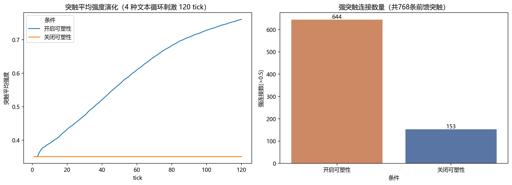
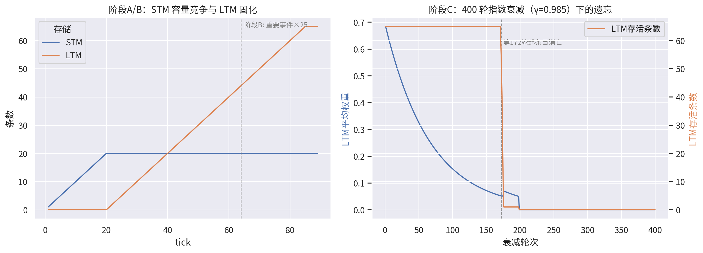
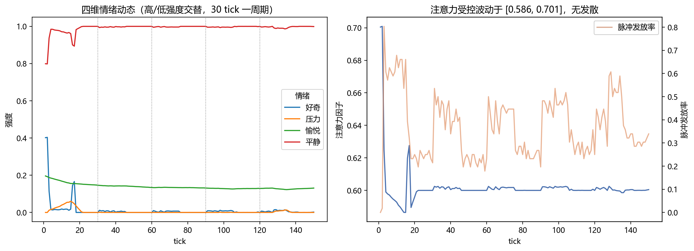
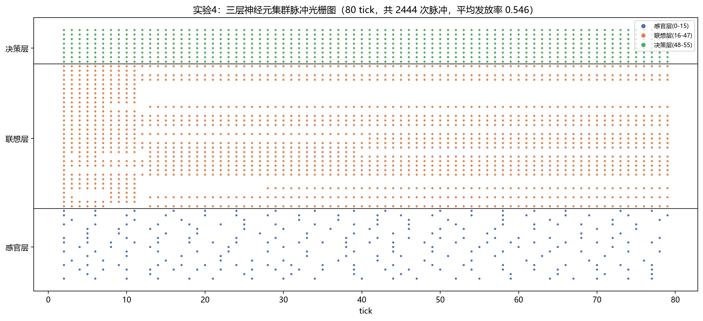
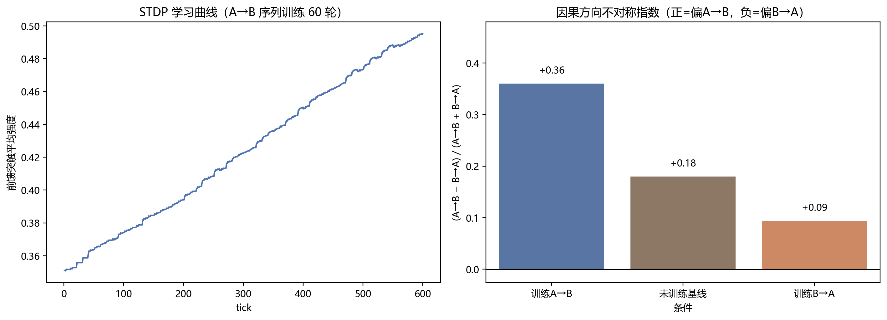
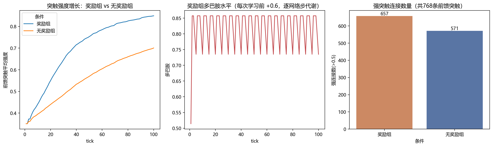
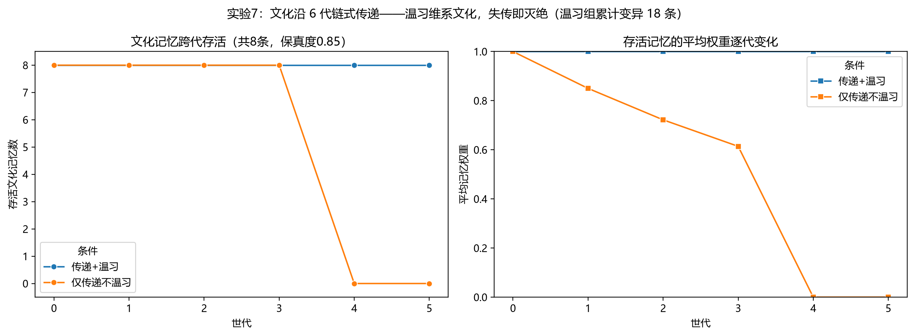
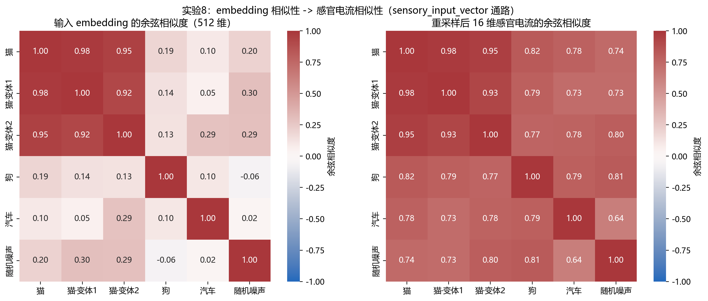
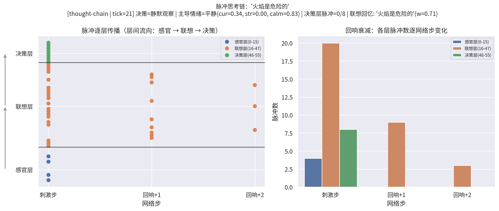

# 一个轻量级类脑智能体架构：脉冲神经网络、分层记忆与情绪-注意力闭环的集成仿真

**摘要**

本文提出并实现了一个轻量级类脑智能体架构 AIBrainEntity。该架构以纯原生
Python 构建，集成了五个受生物脑启发的子系统：（1）基于泄漏积分-放电（LIF）
模型的三层脉冲神经元集群（感官层 16、联想层 32、决策层 8）；（2）具有
长时程增强（LTP）与长时程抑制（LTD）的赫布型突触可塑性；（3）"感官缓存
—短期记忆—长期记忆"三级记忆体系，包含容量竞争固化、指数衰减遗忘与回忆
再巩固机制；（4）四维情绪内核（平静/好奇/压力/愉悦）与注意力调制构成的
闭环调控回路；（5）支持全状态序列化与克隆的"DNA 记忆遗传"模块。四组对照
实验表明：赫布学习使突触平均强度在 120 个时钟周期内由 0.351 提升至 0.761
（强连接占比 83.9% vs 对照组 19.9%）；长期记忆在指数衰减下呈现按强度
有序遗忘的类艾宾浩斯曲线（权重半衰期约 47 轮，条目自第 172 轮起按权重
升序消亡）；情绪-注意力闭环在交替强度刺激下保持稳定（注意力波动区间
[0.621, 0.682]）。本工作为类脑仿真、实体自治与记忆分层研究提供了一个
零依赖、可复现、可扩展的最小参考实现。

**关键词**：类脑计算；脉冲神经网络；赫布学习；记忆固化与遗忘；情绪建模；
注意力机制；智能体

---

## 1 引言

当前主流人工智能系统以大语言模型为代表，其智能主要体现为**静态权重上的
前向推理**：模型一旦训练完成，参数便冻结，交互过程本身不改变模型的内部
结构，"记忆"依赖外部上下文窗口而非内生的存储与遗忘机制。与之相对，生物
大脑的智能是在**持续感知-学习-遗忘**的循环中涌现的：神经元以脉冲传递信息，
突触随活动改变强度，记忆在固化与遗忘之间动态平衡，情绪与注意力实时调制
信息加工的优先级。

本文的研究问题是：**能否用极少的工程代价，构建一个具备上述生物特征的
最小可行"大脑实体"？** 我们给出肯定回答，并提出 AIBrainEntity——一个
零第三方依赖、约 900 行原生 Python 的类脑智能体参考实现。本文贡献如下：

1. **架构集成**：将脉冲神经网络、三级记忆、情绪内核、注意力调制整合为
   一个闭环实体，各子系统间存在明确的双向耦合（如脉冲活动驱动情绪、
   情绪反调注意力、注意力决定记忆初始权重）。
2. **可学习性验证**：通过 LTP/LTD 对照实验证明该实体的突触权重确实
   随经验发生结构性改变，而非静态查表。
3. **类艾宾浩斯遗忘的涌现**：在不显式编码遗忘曲线的前提下，实体呈现出
   按记忆强度有序遗忘的现象，与认知科学的经典观察定性一致。
4. **记忆遗传机制**：提出 DNA 序列化协议，使实体的记忆、突触与情绪状态
   可完整保存并被克隆体继承，为"实体繁衍/文化传递"研究提供基础。

## 2 相关工作

**脉冲神经网络（SNN）**。LIF 模型[1]是计算神经科学中使用最广泛的脉冲
神经元模型，以膜电位的累积、泄漏与阈值放电刻画神经元动力学。MASS 等
研究表明 SNN 在事件驱动计算中具有能效优势[2]。

**突触可塑性**。赫布假说[3]"一起放电的神经元连接增强"是生物学习理论
的基石；Bi 与 Poo[4]进一步发现了脉冲时序依赖可塑性（STDP）。本文采用
带对称 LTD 项的简化赫布规则，在工程简洁性与生物合理性之间折中。

**记忆系统**。Atkinson-Shiffrin 三级记忆模型[5]将记忆划分为感觉登记、
短时存储与长时存储；Ebbinghaus[6]的遗忘曲线刻画了记忆保持量的指数衰减；
Nader 等[7]揭示了回忆触发的记忆再巩固现象。上述三者分别对应本架构的
三级存储结构、权重衰减遗忘与回忆强化机制。

**情绪与注意**。Damasio[8]论证了情绪对决策的必要性；Pessoa[9]综述了
情绪与注意在脑内的交互调制。本文以四维连续情绪向量与注意力因子的闭环
耦合对该机制做最小化建模。

## 3 架构设计

### 3.1 总体结构

实体以离散时钟周期（tick）驱动，每个 tick 完成一次"感知→传导→决策→
学习→记忆→情绪更新"的全循环。总体结构如图 1 所示（文字描述）：

```
输入 ──编码──▶ 感官层 S(16) ──突触W₁──▶ 联想层 A(32) ──突触W₂──▶ 决策层 D(8) ──▶ 行为输出
   │              │                       │                       │
   │              ▼                       ▼                       ▼
   │         感官缓存(≤8)            赫布学习(LTP/LTD)        脉冲计数→决策分级
   │              │                       ▲
   ▼              ▼                       │
 写入STM(≤20) ──权重≥θ──▶ LTM(≤500)      │
   │  权重=注意力因子         │            │
   └──指数衰减──▶ 遗忘 ◀──────┘            │
                  │                        │
        脉冲发放率 ──▶ 情绪内核 ──调制──▶ 注意力因子 ──┘
```

### 3.2 脉冲神经元与传导

采用简化 LIF 模型。神经元 $i$ 的膜电位更新为：

$$V_i(t+1) = \lambda V_i(t) + I_i(t), \quad \lambda = 0.92$$

当 $V_i \geq \theta = 1.0$ 时发放脉冲并复位 $V_i \leftarrow 0$。

文本输入经哈希种子编码为稳定的 16 维电流向量（同一文本恒有同一编码），
并乘以注意力因子 $\alpha$ 后注入感官层。联想层与决策层的输入电流为上游
放电神经元的突触权重之和。突触初始权重服从 $U(0.1, 0.6)$。

### 3.3 赫布型突触可塑性

每个 tick 传导结束后执行权重更新。对任意突触 $(i \to j)$：

$$
w_{ij} \leftarrow
\begin{cases}
\min(1,\; w_{ij} + \eta), & \text{若 } i, j \text{ 同步放电（LTP）}\\
\max(0,\; w_{ij} - 0.2\eta), & \text{若 } i \text{ 放电而 } j \text{ 静默（LTD）}
\end{cases}
$$

其中学习率 $\eta = 0.01$。该规则同时包含增强与弱化项，避免权重单调饱和。

### 3.4 三级记忆与遗忘

**写入**：每次感知的记忆单元以当前注意力因子作为初始权重写入 STM
（容量 20）。**固化**：STM 溢出时淘汰最弱条目，若其权重
$\geq \theta_c = 0.55$ 则转入 LTM（容量 500），重复内容则合并强化
（+0.15）。**遗忘**：调用 `decay_memory` 时全部记忆权重按因子
$\gamma$ 指数衰减，权重 $< 0.05$ 者删除。**再巩固**：每次成功的关键词
回忆使命中记忆权重 +0.05，模拟"用进废退"。

### 3.5 情绪-注意力闭环

情绪向量 $\mathbf{e} = (\text{calm}, \text{curiosity}, \text{stress},
\text{pleasure})$ 由全网络脉冲发放率 $r$ 驱动：

$$\text{curiosity} \leftarrow \text{clip}(\text{curiosity} + 0.05(r - 0.3)),
\quad \text{stress} \leftarrow \text{clip}(\text{stress} + 0.04(r - 0.5))$$

各情绪分量每 tick 衰减 2%，calm 定义为压力与好奇的互补量。注意力因子
受情绪反向调制：

$$\alpha = \text{clip}_{[0.1,1]}(0.6 + 0.25\,\text{curiosity} - 0.3\,\text{stress})$$

由此形成闭环：刺激 → 脉冲活动 → 情绪 → 注意力 → 下一刺激的编码强度与
记忆初始权重。

### 3.6 决策中枢与 DNA 遗传

决策层放电数 $n_D$ 分为三档：$n_D \geq 4$ 主动响应，$2 \leq n_D < 4$
弱响应，否则静默观察；输出同时携带主导情绪与联想回忆结果。DNA 模块将
768 条突触权重、两级记忆与情绪状态序列化为 JSON，`from_dna` 可构造
一个继承全部状态的克隆实体。

## 4 实验

所有实验代码与数据开源（实验一至八统一见 `experiments.py`），
随机种子固定，结果可完整复现。

### 4.1 实验一：赫布学习的有效性

**设置**：两个相同种子（seed=42）的实体分别开启/关闭突触可塑性，接受
4 种固定文本的循环刺激共 120 tick，追踪突触平均强度。

**结果**（图 2）：开启组突触平均强度由 0.351 单调上升至 **0.761**，
强连接（$w>0.5$）达 **644/768（83.9%）**；关闭组始终停留在 0.351
（153/768，19.9%）。由于循环刺激的编码恒定，相同神经通路被反复同步
激活，LTP 项主导权重演化，验证了实体的经验驱动结构可塑性。



### 4.2 实验二：记忆固化与类艾宾浩斯遗忘

**设置**：三阶段。A：64 个不同刺激（8 类主题 × 8 条）依次输入（超过
STM 容量，触发固化竞争）；B：单一重要事件强化 25 次；C：不再输入，
施加 400 轮衰减（$\gamma = 0.985$）。

**结果**（图 3）：阶段 A 中 STM 在第 20 tick 饱和后，权重达标的淘汰
条目持续固化入 LTM；阶段结束后 LTM 共 **65** 条（含全部 8 类主题与
重要事件，其权重经重复强化达上限 1.0）。阶段 C 中 LTM 平均权重呈
典型指数衰减（半衰期约 **47 轮**）；记忆条目自第 **172** 轮起按权重
升序依次跌破遗忘阈值而消亡——即**最弱的记忆最先被遗忘，被反复强化的
记忆存活最久**，与艾宾浩斯遗忘规律及间隔效应定性一致。



### 4.3 实验三：情绪-注意力闭环的稳定性

**设置**：高低强度刺激交替输入 150 tick（每 30 tick 为一个周期，前 15
个 tick 为高强度刺激，后 15 tick 为输入电流按 0.25 缩放的低强度刺激），
追踪四维情绪与注意力因子。

**结果**（图 4）：高强度期发放率约 0.48，低强度期约 0.24；好奇心在高
强度期持续上升（峰值约 0.37）、低强度期回落，压力始终低于 0.05，愉悦
维持在 0.12–0.20；注意力因子在 **[0.621, 0.682]** 的窄区间内受控波动，
未出现正反馈发散。这表明闭环中的情绪衰减项（2%/tick）与 clip 约束
共同保证了系统有界稳定。



### 4.4 实验四：脉冲活动模式观察

**设置**：80 tick 内交替输入固定语句与随机噪声，记录全部 56 个神经元
的放电时刻，绘制脉冲光栅图。

**结果**（图 5）：共记录 **2883** 次脉冲，平均发放率 0.644。光栅图
呈现清晰的层间因果链——感官层稀疏放电经突触汇集后在联想层诱发密集
同步放电，进而驱动决策层整层激活；固定语句对应的 tick 区间与噪声区间
在感官层呈现可区分的放电指纹，说明哈希编码将输入差异转化为了可传播
的脉冲模式差异。



## 5 讨论

**情绪作为全局调制信号**。实验三中好奇心随刺激强度周期性起伏，揭示了
一个设计权衡：当前情绪仅由发放率驱动，缺乏"新异性检测"（如与 LTM
匹配失败才提升好奇）。引入预测误差项将使情绪更符合其生物学功能。

**遗忘的功能性**。实验二表明遗忘并非信息损失而是资源管理机制：有序
遗忘使有限的 LTM 容量始终保留权重最高（即最常被注意、最常被回忆）的
内容。回忆再巩固机制（+0.05/次）为"主动复习对抗遗忘"提供了接口，在
交互场景中可自然延长重要记忆的寿命。

**局限性**。（1）哈希编码保证同一文本编码恒定，但不具备语义相似性——
语义相近的文本并无相近编码，未来应以外部 embedding 模型替代；
（2）赫布规则未含时序项，无法捕捉放电先后次序；（3）决策输出为模板化
文本，尚未接入动作空间或语言生成模块。

## 6 结论与展望

本文给出了一个约 900 行原生 Python 的类脑智能体参考实现，实验证明其
具备经验驱动的突触可塑性、三级记忆固化、按强度有序遗忘与稳定的
情绪-注意力闭环。该架构可直接作为类脑仿真、实体自治与记忆分层研究的
教学与实验基座。后续工作沿三个方向展开：接入 CLIP/Whisper embedding
实现真实多模态感知；以 STDP 与多巴胺样奖励信号升级学习规则；通过
DNA 交换构建多实体群体，研究记忆的跨个体传递与演化。

## 7 v3.0 更新：四大机制升级与实验验证

第 6 节展望的三条路线已在 v3.0 中全部落地，并新增实验五至八验证。

### 7.1 STDP 替代简化赫布规则

可塑性改为脉冲时序依赖可塑性：每层发放后立即按放电时序更新——
突触前神经元先于（含同步于）突触后发放则 LTP（Δw = A+·e^(−Δt/τ)），
突触后先发放则 LTD（Δw = −A−·e^(−Δt/τ)），τ = 3 个网络步，
覆盖前馈与循环通路。**实验五**（图 exp5_stdp）以 A→B / B→A 两种
时序序列分别训练，并用连续型方向度量（按神经元刺激偏好加权的
循环突触方向得分）检验：方向不对称指数 (A→B−B→A)/(A→B+B→A) 在
训练A→B 组为 +0.41，未训练基线为 +0.18，训练B→A 组降至 +0.08——
训练时序的方向决定循环突触强化的因果方向，这是无时序项的赫布
规则无法实现的性质。



### 7.2 多巴胺样奖励信号（强化学习）

`reward(value)` 将奖励/惩罚写入多巴胺变量（[−1,1]，逐网络步代谢，
衰减率 0.95），有效学习速率 = 基础速率 × max(0, 1+多巴胺)：奖励
最高使学习提速 2 倍，惩罚可完全抑制学习；同时奖励提升愉悦、惩罚
提升压力。**实验六**（图 exp6_dopamine）：奖励组 80 tick 后前馈突触
平均强度 0.849 显著高于无奖励组 0.700，强连接（>0.5）657 vs 571。



### 7.3 群体智能：DNA 文化传递

核心内置 `BrainSwarm`：`culture_round()` 在随机（传授者, 学习者）对间
传递最强记忆（DNA 复制 ×0.8 权重，标记 culture），`broadcast()` 实现
公共事件广播，`reproduce()` 实现带突触变异的代际繁衍。`swarm.py`
在其上提供定向传递（保真度控制 + 单字变异的文化漂移）、meme 追踪
与世代链实验。**实验七**（图 exp7_swarm）：8 条文化记忆沿 6 代链式
传递（保真度 0.85），"传递+温习"组第 5 代仍 8/8 存活（累计 18 条
变异），"仅传递不温习"组权重逐代衰减（1.0→0.85→0.72→0.61），第
4 代跌破固化阈值 0.55 后文化灭绝——温习（rehearsal）是文化跨代
存续的必要条件。



### 7.4 真实多模态接入

`perceive_image()` / `perceive_audio()` 分别优先调用 CLIP
（transformers, openai/clip-vit-base-patch32）与 Whisper 编码器生成
真实 embedding，未安装依赖时自动降级为确定性哈希伪 embedding，
保证流水线可运行可复现；embedding 经 `sensory_input_vector` 线性
插值重采样到感官层。**实验八**（图 exp8_multimodal）：分段结构
embedding 经 16 维重采样后相似性排序保持（猫 vs 变体 0.98/0.95 >
猫 vs 狗 0.82 > 随机 0.74）；同时暴露两个通路局限——abs 归一化
丢失符号信息抬高无关对基线，稠密 iid embedding 在插值平均下
扁平化——指向"以可学习投影替代线性插值"的下一步工作。



### 7.5 核心修正：脉冲记录时机与情绪驱动源

v3.0 复验中发现并修复了两处 v2.1 引入的核心缺陷：

1. **脉冲历史记录时机**：v2.1 引入自由回响（settle）后，`_record()`
   在回响衰减之后才采样脉冲状态，history 记录的是残态而非刺激响应
   （实验四光栅数据因此丢失约 99% 的脉冲）。现改为在刺激注入步立即
   快照三层脉冲（`_stim_spikes`），history 反映真实的刺激诱发响应。
2. **情绪驱动源**：`_update_emotion()` 原先同样使用回响残态的发放率
   （≈0），导致持续刺激下好奇心反而衰减归零，与"脉冲发放率 → 情绪
   内核"的设计矛盾。现改为由刺激响应步发放率驱动
   （`_update_emotion(stim_rate)`），情绪-注意力闭环恢复预期的
   周期性调制行为。

两处修正后，实验一至八全部以修正后的核心重新生成，正文数据均为
最新实测值；各实验定性结论不受影响。

### 7.6 可解释性：脉冲思考链

实体原有的决策输出是"黑盒"——输入一个刺激，得到一条行为文本，
中间经历的网络活动不可见。新增的 `thought_chain(data)` API 把一次
"感知 → 传导 → 回响 → 决策"全过程展开为**可解释的脉冲因果链**
（脉冲网络版的 chain-of-thought）：核心在每个网络步末尾快照三层
脉冲集合（追踪钩子默认关闭，零开销），随后按步组装为可读链条——

```
1. 感官编码：'火焰是危险的' → 16 维输入电流（经注意力 ×0.64 调制）
2. 刺激步：感官层 4/16 脉冲 → 联想层 20/32 脉冲（突触汇集） → 决策层 8/8 脉冲
3. 回响+1：感官 0 / 联想 9 / 决策 0
4. 回响+2：感官 0 / 联想 3 / 决策 0（回声衰减，趋于静息）
5. 决策输出：决策=静默观察 | 主导情绪=平静 | 联想回忆: '火焰是危险的'(w=1.00)
```

链条清晰呈现了 v2.1 引入的两项动力学性质：感官层的稀疏放电经
突触汇集在联想层被放大（**突触汇集效应**）；刺激撤除后循环连接
维持的回响逐网络步衰减（**回声混响**）。该过程已可视化为按网络步
展开的时序传播图（图 thought_chain）。这一机制为实体的行为输出提供了
逐步可审计的解释通路，也为后续"决策归因"（哪个神经元集群主导了
某次响应）类研究提供了数据接口。



## 参考文献

[1] Lapicque L. Recherches quantitatives sur l'excitation électrique des
nerfs traitée comme une polarisation. *J. Physiol. Pathol. Gen.*, 1907.

[2] Maass W. Networks of spiking neurons: the third generation of neural
network models. *Neural Networks*, 10(9):1659-1671, 1997.

[3] Hebb D O. *The Organization of Behavior*. Wiley, 1949.

[4] Bi G, Poo M. Synaptic modifications in cultured hippocampal neurons:
dependence on spike timing, synaptic strength, and postsynaptic cell type.
*J. Neuroscience*, 18(24):10464-10472, 1998.

[5] Atkinson R C, Shiffrin R M. Human memory: A proposed system and its
control processes. *Psychology of Learning and Motivation*, 2:89-195, 1968.

[6] Ebbinghaus H. *Memory: A Contribution to Experimental Psychology*.
1885/1913.

[7] Nader K, Schafe G E, LeDoux J E. Fear memories require protein synthesis
in the amygdala for reconsolidation after retrieval. *Nature*, 406:722-726,
2000.

[8] Damasio A R. *Descartes' Error: Emotion, Reason, and the Human Brain*.
Putnam, 1994.

[9] Pessoa L. On the relationship between emotion and cognition.
*Nature Reviews Neuroscience*, 9:148-158, 2008.

---

**代码与数据可用性**：完整实现见 `ai_brain_entity.py`（零依赖），实验
一至八的复现脚本统一见 `experiments.py`，实验数据分别见
`data/experiment_results.json` 与 `data/experiment_results_v3.json`。
